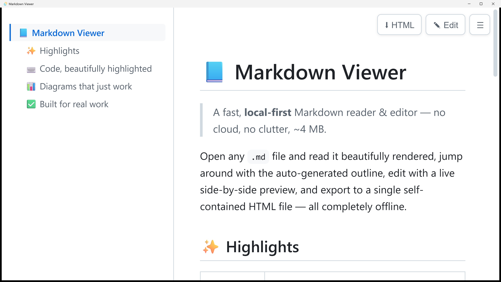
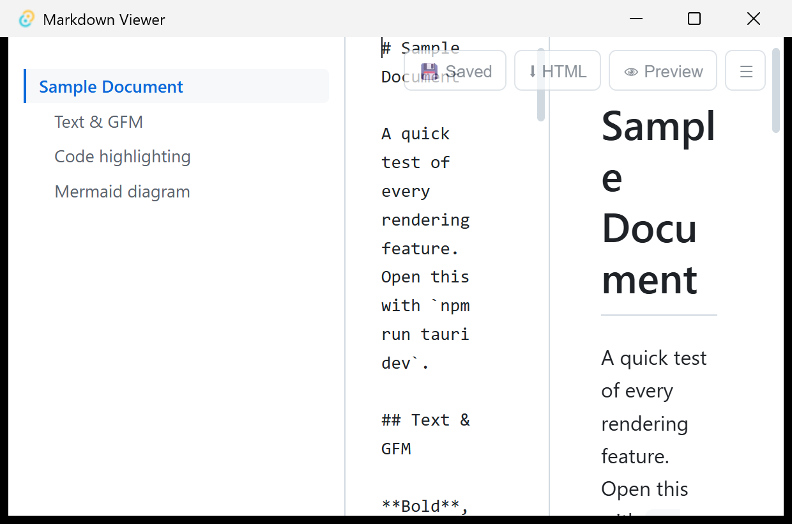

# Markdown Viewer

**繁體中文** | [English](README.en.md)

一款**輕量、完全本機**的 Markdown 檢視器與編輯器,支援 Windows、macOS 與 Linux。
以 **Tauri v2** 打造,使用作業系統內建的 WebView(Windows 用 WebView2、macOS 用
WKWebView、Linux 用 WebKitGTK),而非內嵌整個 Chromium —— 因此 Windows 執行檔僅
**約 4 MB**,閒置記憶體約 **30–60 MB**。

雙擊任何 `.md` 檔即可瞬間開啟、漂亮渲染 —— 內建可導覽的章節大綱、程式碼語法高亮、
Mermaid 圖表、可即時預覽的編輯器,以及一鍵匯出成自包含的 HTML 檔。沒有安裝包肥大、
沒有雲端、沒有遙測,全部離線運作。

## 螢幕截圖

### 閱讀模式 —— 大綱 + 渲染後的 Markdown

左側的**章節大綱(TOC)**會依文件標題自動產生;點任一項即可跳轉,並會高亮你目前
正在閱讀的章節。



### 編輯模式 —— 即時編輯與預覽

按 **Edit**(或 `Ctrl+E`)開啟分割編輯器。預覽會隨輸入即時更新,左右兩欄**同步捲動**,
按 `Ctrl+S` 即可存回磁碟。



## 功能特色

- **GFM 渲染** —— 表格、任務清單、刪除線(`markdown-it`)
- **程式碼語法高亮**(`highlight.js`)
- **Mermaid 圖表** —— 延遲載入,只有文件實際含有 ` ```mermaid ` 區塊時才載入,
  純文字文件完全不需付出這份成本
- **大綱 / TOC 側欄** —— 依標題自動建立、捲動時高亮目前章節、可用 `Ctrl+\` 收合
- **即時編輯與預覽** —— 分割編輯器、左右同步捲動(`Ctrl+E`)、`Ctrl+S` 存檔,
  關閉時若有未存檔變更會跳出確認
- **匯出 HTML** —— 在原檔旁產生單一自包含的 `.html`,內含大綱側欄、語法高亮的
  程式碼,以及內嵌的 Mermaid SVG 圖
- **即時重載** —— 監看開啟中的檔案,存檔後自動重新渲染
- **檔案關聯** —— 雙擊任何 `.md` / `.markdown` 檔即可開啟
- **拖放** —— 把 Markdown 檔拖進視窗即可開啟
- 深色 / 淺色主題跟隨系統設定
- 外部連結以你的預設瀏覽器開啟

## 下載

到 [**Releases**](https://github.com/craig7351/bookMDViewer/releases/latest) 頁面取得最新版本:

| 平台 | 檔案 |
| --- | --- |
| Windows(免安裝可攜版) | `Markdown.Viewer_*_x64_portable.exe` |
| Windows(安裝版) | `Markdown.Viewer_*_x64-setup.exe` 或 `*_x64_en-US.msi` |
| macOS(Apple Silicon / Intel) | `*_aarch64.dmg` / `*_x64.dmg` |
| Linux | `*_amd64.AppImage`、`*_amd64.deb`、`*.x86_64.rpm` |

> 安裝版會註冊 `.md` 檔案關聯(雙擊即可開啟);可攜版免安裝即可執行,但不會更改
> 檔案關聯。所有版本都需要系統內建的 WebView(Windows 11 已預載 WebView2)。

## 鍵盤快捷鍵

| 快捷鍵 | 動作 |
| --- | --- |
| `Ctrl+E` | 切換編輯 / 預覽 |
| `Ctrl+S` | 存檔 |
| `Ctrl+\` | 切換大綱側欄 |
| `Ctrl++` / `Ctrl+-` | 字型放大 / 縮小(也可用右上角 `A+` / `A−` 按鈕) |

## 啟動參數

```bash
md-viewer.exe file.md            # 開啟並渲染
md-viewer.exe file.md --edit     # 直接進入編輯模式
md-viewer.exe file.md --zoom=1.5 # 整體 UI 放大(高 DPI / 無障礙)
```

## 開發

```bash
npm install
npm run tauri dev
```

## 在本機建置執行檔

```bash
npm run tauri build
```

產出(Windows):`src-tauri/target/release/md-viewer.exe`,以及位於
`src-tauri/target/release/bundle/` 的 NSIS / MSI 安裝檔。

## 跨平台發佈

推送版本 tag,GitHub Actions 會建置 Windows / macOS(Intel + Apple Silicon)/
Linux 安裝檔 —— 外加一個 Windows 可攜版 exe —— 並發佈到 release:

```bash
git tag v1.0.0
git push origin v1.0.0
```

詳見 [.github/workflows/release.yml](.github/workflows/release.yml)。
