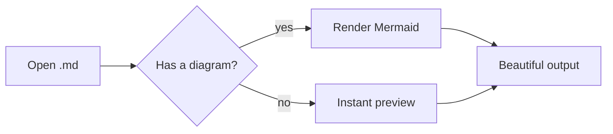

# 📘 Markdown Viewer

> A fast, **local-first** Markdown reader & editor — no cloud, no clutter, ~4 MB.

Open any `.md` file and read it beautifully rendered, jump around with the
auto-generated outline, edit with a live side-by-side preview, and export to a
single self-contained HTML file — all completely offline.

## ✨ Highlights

| Feature        | What you get                                   |
| -------------- | ---------------------------------------------- |
| **Reading**    | Clean typography, dark mode, navigable outline |
| **Editing**    | Split editor with synced-scroll live preview   |
| **Diagrams**   | Mermaid flowcharts rendered inline             |
| **Export**     | One-click, self-contained HTML                 |
| **Footprint**  | ~4 MB binary, shares the system WebView        |

## ⌨️ Code, beautifully highlighted

```ts
// Render Markdown in milliseconds — fully offline.
import MarkdownIt from "markdown-it";

const md = new MarkdownIt({ html: true, linkify: true, typographer: true });

export function render(source: string): string {
  return md.render(source);
}
```

## 📊 Diagrams that just work



## ✅ Built for real work

- [x] GitHub-Flavored Markdown — tables, task lists, ~~strikethrough~~
- [x] Syntax highlighting for 100+ languages
- [x] Live reload when the file changes on disk
- [ ] Heavyweight Electron bloat — *nope, not here*

> **Tip:** press `Ctrl+E` to edit, `Ctrl+S` to save, and `Ctrl+\` to toggle the outline.
