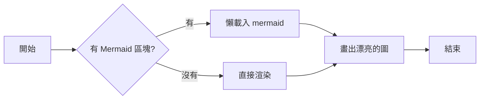
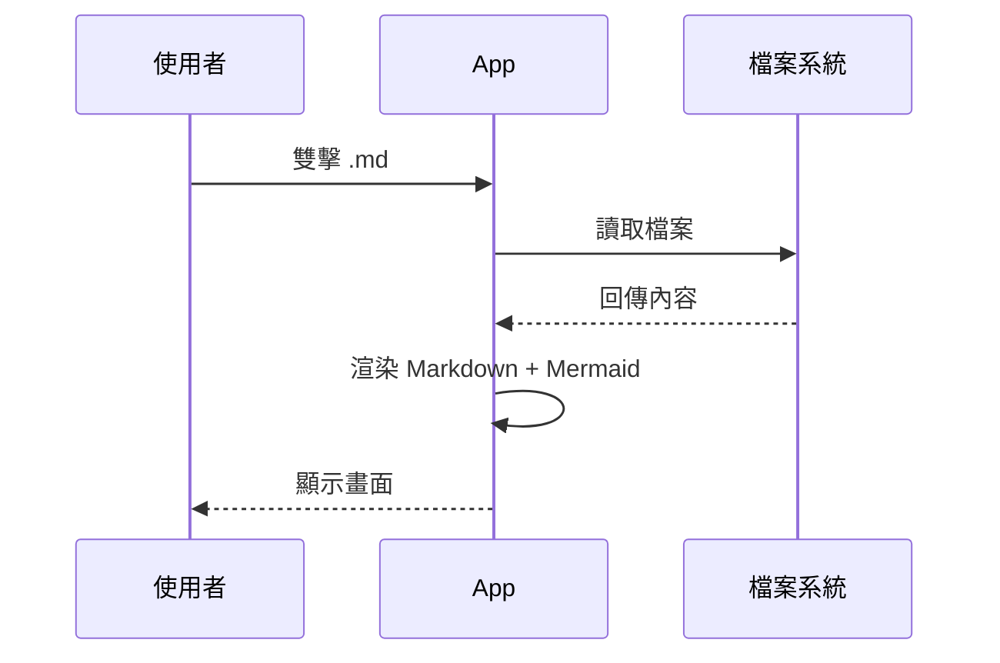
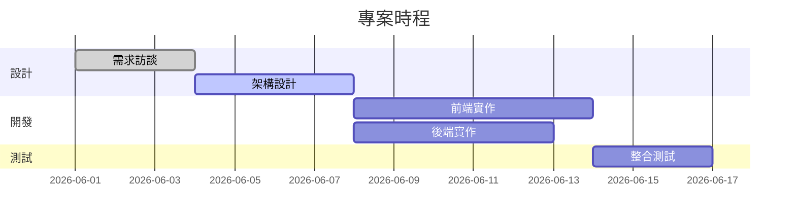
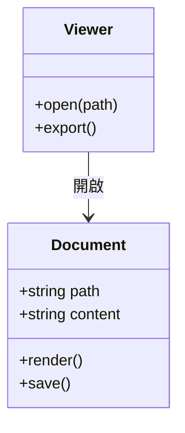
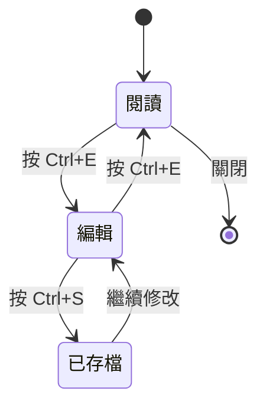
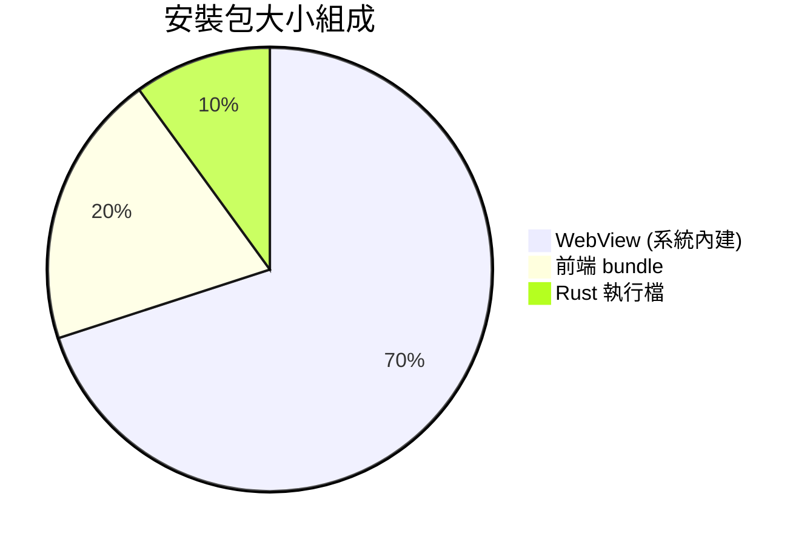
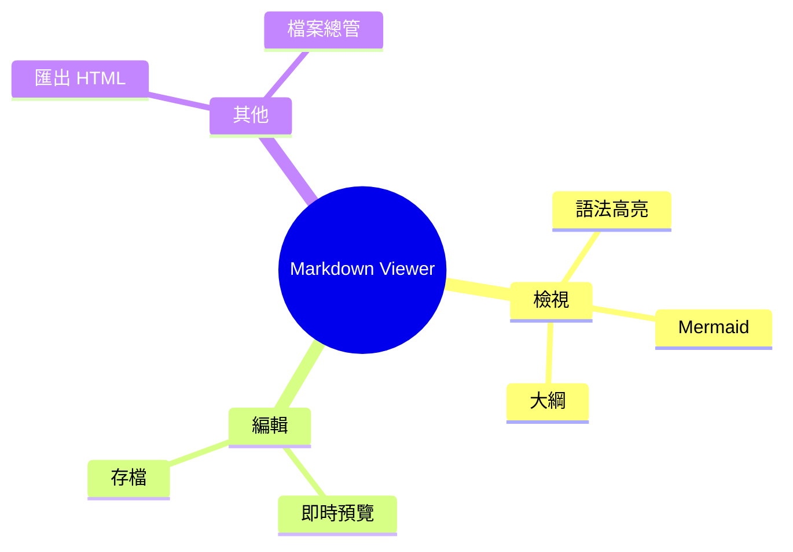

# Mermaid 圖表示範

這份文件示範常見的 Mermaid 圖表類型。用 Markdown Viewer 開啟即可看到渲染後的圖。

## 流程圖 Flowchart

```mermaid
flowchart LR
    A[開始] --> B{有 Mermaid 區塊?}
    B -- 有 --> C[懶載入 mermaid]
    B -- 沒有 --> D[直接渲染]
    C --> E[畫出漂亮的圖]
    D --> E
    E --> F[結束]
```

## 時序圖 Sequence

```mermaid
sequenceDiagram
    participant U as 使用者
    participant A as App
    participant FS as 檔案系統
    U->>A: 雙擊 .md
    A->>FS: 讀取檔案
    FS-->>A: 回傳內容
    A->>A: 渲染 Markdown + Mermaid
    A-->>U: 顯示畫面
```

## 甘特圖 Gantt

```mermaid
gantt
    title 專案時程
    dateFormat YYYY-MM-DD
    section 設計
    需求訪談       :done,    des1, 2026-06-01, 3d
    架構設計       :active,  des2, 2026-06-04, 4d
    section 開發
    前端實作       :         dev1, 2026-06-08, 6d
    後端實作       :         dev2, 2026-06-08, 5d
    section 測試
    整合測試       :         test1, after dev1, 3d
```

## 類別圖 Class

```mermaid
classDiagram
    class Document {
        +string path
        +string content
        +render()
        +save()
    }
    class Viewer {
        +open(path)
        +export()
    }
    Viewer --> Document : 開啟
```

## 狀態圖 State

```mermaid
stateDiagram-v2
    [*] --> 閱讀
    閱讀 --> 編輯 : 按 Ctrl+E
    編輯 --> 閱讀 : 按 Ctrl+E
    編輯 --> 已存檔 : 按 Ctrl+S
    已存檔 --> 編輯 : 繼續修改
    閱讀 --> [*] : 關閉
```

## 圓餅圖 Pie

```mermaid
pie title 安裝包大小組成
    "WebView (系統內建)" : 70
    "前端 bundle" : 20
    "Rust 執行檔" : 10
```

## 心智圖 Mindmap

```mermaid
mindmap
  root((Markdown Viewer))
    檢視
      語法高亮
      Mermaid
      大綱
    編輯
      即時預覽
      存檔
    其他
      匯出 HTML
      檔案總管
```
