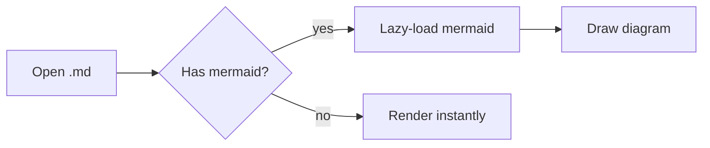

# Sample Document

A quick test of every rendering feature. Open this with `npm run tauri dev`.

## Text & GFM

**Bold**, _italic_, ~~strikethrough~~, `inline code`, and a [link](https://tauri.app).

- [x] Task lists work
- [ ] This one is unchecked
- Regular bullet

| Feature | Status |
| ------- | :----: |
| Tables  |   ✅   |
| Mermaid |   ✅   |

> A blockquote for good measure.

## Code highlighting

```rust
fn main() {
    println!("Hello from Rust!");
}
```

```ts
const greet = (name: string): string => `Hello, ${name}!`;
```

## Mermaid diagram


